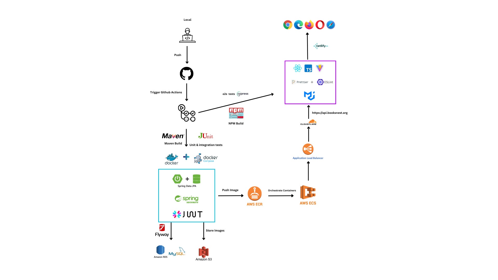
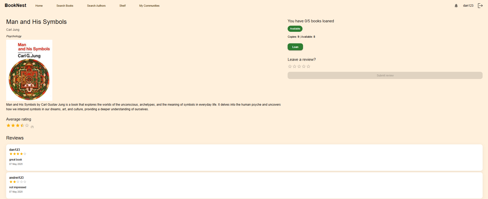
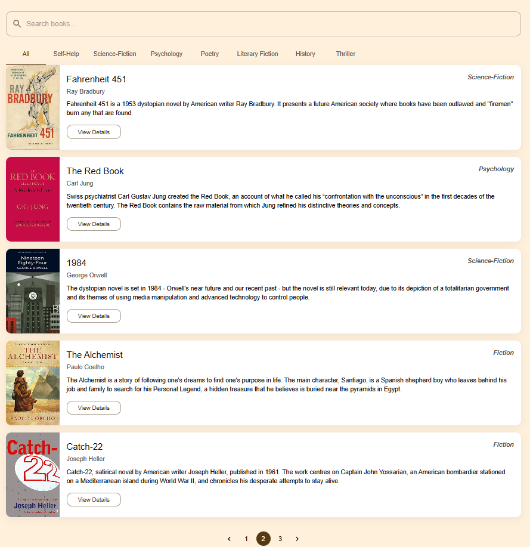
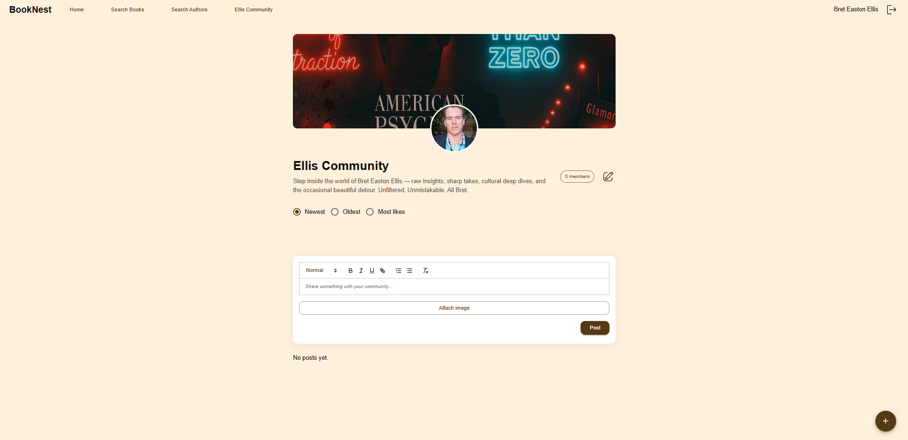
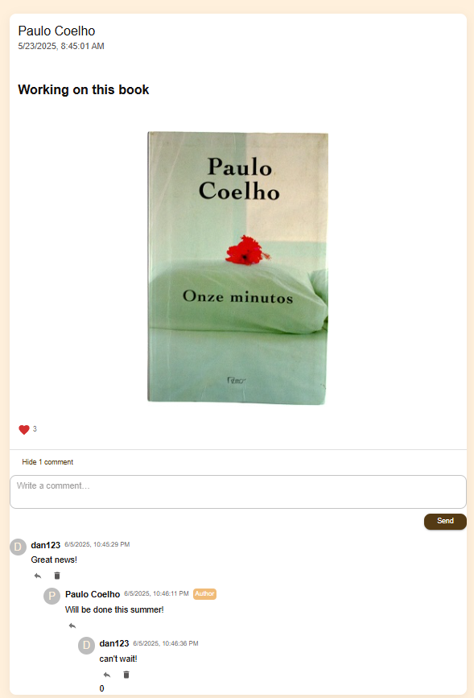
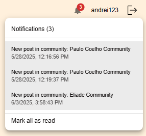

# 📚 Booknest – Community-Driven Online Bookstore  

---

## ✨ What is Booknest?  
**Booknest** is a community-driven online bookstore that blends book discovery, borrowing, and reviews with **author-led communities**.  
Unlike Goodreads or LibraryThing, here authors and readers can interact directly: authors run their own communities, post updates, and fans can comment, like, and get **real-time notifications**.  

---

## 🚀 Features  

### 👤 Basic Users
- 🔍 Search books & authors  
- 📖 Borrow up to **5 books** at a time (3-day loan period)  
- ⭐ Leave reviews & ratings  
- 💬 Join author communities, like & comment on posts  
- 🔔 Get notifications for new posts  

### ✍️ Authors
- 📝 Create **one author community**  
- 📸 Post updates with optional images  
- 💬 Interact with fans in threaded comments  
- 🗑️ Moderate comments on their posts  

### 🛡️ Admins
- 📚 Manage book library (CRUD)  
- 🚨 Oversee communities and remove inappropriate posts/comments

---

## 🛠️ Tech Stack
- **Backend:** Spring Boot, Spring Data JPA, Flyway, JWT with RSA, JUnit tests  
- **Frontend:** React + Vite + TypeScript, React Query, React Router, MUI, Cypress  
- **Database:** MySQL (hosted on AWS RDS)  
- **Cloud:** AWS (S3, RDS, ECR, ECS Fargate, ALB, ACM, Cloudflare DNS)  
- **CI/CD:** GitHub Actions + OIDC for AWS deploy

---

## 🔐 Authentication & Security  
- JWT-based authentication (RSA keypair signing/verification)  
- Role-based access: `USER`, `AUTHOR`, `ADMIN`  
- Email verification with 6-digit codes + scheduled cleanup for unverified accounts  

---

## 📸 Screenshots  
#### System Workflow
  

#### Book Details Page
  

#### Search Books Page
  

#### Author Community Page
  

#### Post with Comments
  

#### Notification List
  

---

## 🔄 CI/CD
- Detect changes workflow: only run jobs for changed services
- Backend jobs: build, test, Dockerize, push to ECR, deploy on ECS
- Frontend jobs: build, lint, Cypress tests, deploy to Netlify
- Rollback enabled on deployment failure

---

## ☁️ Deployment
- Backend: AWS ECS (Fargate) + ALB + RDS + S3
- Frontend: Netlify (static hosting over HTTPS)
- Security: AWS IAM roles via OIDC + Security Groups + HTTPS certs via ACM

---

## 🛣️ Future Work
- 🎥 Live author Q&A sessions
- 📱 Mobile app (React Native)
- 📊 Personalized recommendations

---

## 🙌 Acknowledgments
This project was developed as part of my **Bachelor’s Thesis in Computer Science**.
Special thanks to my thesis supervisor, peers, and the open-source community.

## 📄 MIT License
